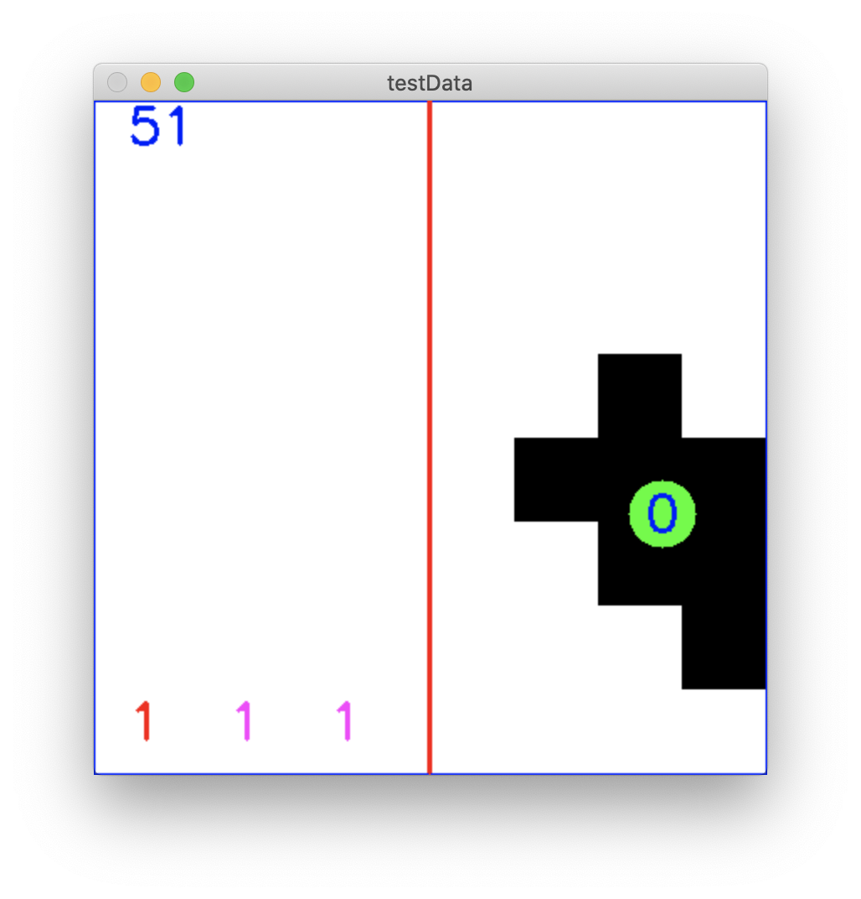

<h1>A low-resolution thermal imaging people detection</h1>

Implementation of a people counter for a 8x8 thermal sensor (PUREmodules - Grid-Eye Breakout).
 
The counter was implemented with 3 aglorithims:
 
<ul>
  <li>Blob Detection and Tracking</li>
  <li>Multi Layer Perceptrion (MLP)</li>
  <li>Recurrent Neural Network (RNN)</li>
</ul>

  A short example of all 3 counters implemented in 1 program can be seen in this<a href="https://youtu.be/aTNNey4ACRM">YouTube video</a>. In the bottom left corner we have the blob, MPL and RNN counters in this order. 

  With the limited training and testing datasets the counters achieved the following accuracy rates:
  <ul>
    <li>Blob Detection and Tracking - 100%</li>
    <li>MLP - 92.01%</li>
    <li>RNN - 99.23%</li>
  </ul>

